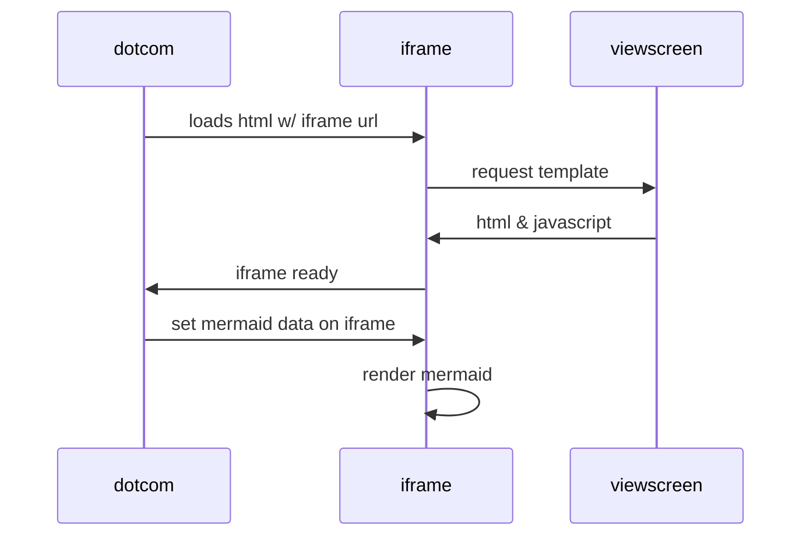
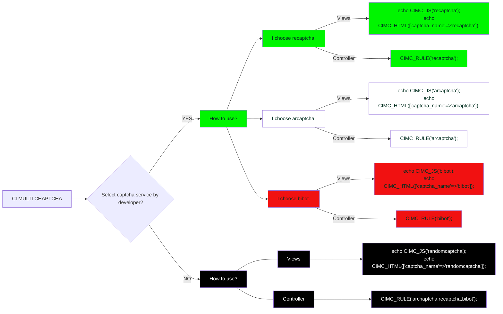
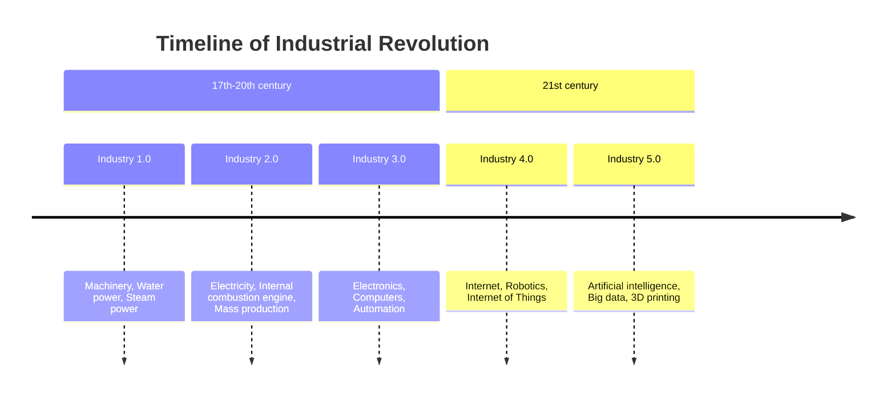
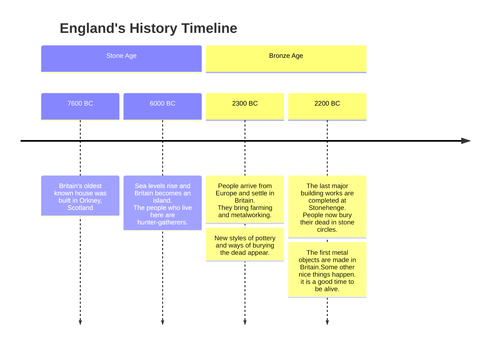
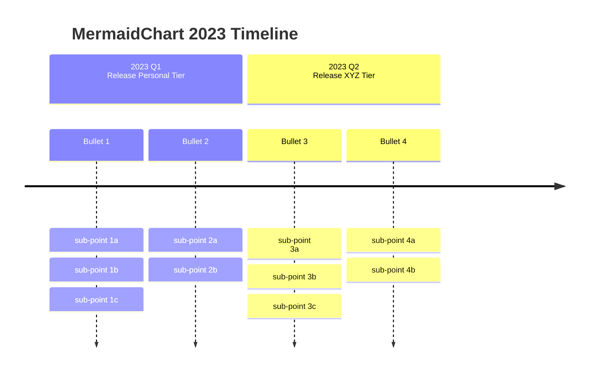
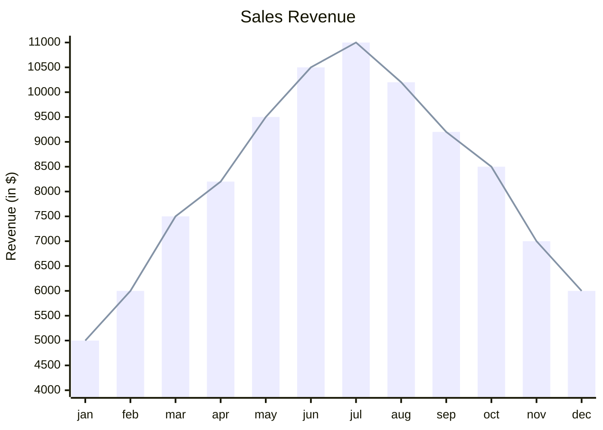

```mermaid
sequenceDiagram
    participant dotcom
    participant iframe
    participant viewscreen
    dotcom->>iframe: loads html w/ iframe url
    iframe->>viewscreen: request template
    viewscreen->>iframe: html & javascript
    iframe->>dotcom: iframe ready
    dotcom->>iframe: set mermaid data on iframe
    iframe->>iframe: render mermaid
```

```mermaid
  flowchart LR;
      A[CI MULTI CHAPTCHA]-->B{Select captcha service by developer?};
      classDef green color:#022e1f,fill:#00f500;
      classDef red color:#022e1f,fill:#f11111;
      classDef white color:#022e1f,fill:#fff;
      classDef black color:#fff,fill:#000;
      B--YES-->C[How to use?]:::green;
      
      C-->U[I choose recaptcha.]:::green;
      U--Views-->Q["echo CIMC_JS('recaptcha');\n echo CIMC_HTML(['captcha_name'=>'recaptcha']);"]:::green;
      U--Controller-->W["CIMC_RULE('recaptcha');"]:::green;
      
      C-->I[I choose arcaptcha.]:::white;
      I--Views-->O["echo CIMC_JS('arcaptcha');\n echo CIMC_HTML(['captcha_name'=>'arcaptcha']);"]:::white;
      I--Controller-->P["CIMC_RULE('arcaptcha');"]:::white;
      
      C-->X[I choose bibot.]:::red;
      X--Views-->V["echo CIMC_JS('bibot');\n echo CIMC_HTML(['captcha_name'=>'bibot']);"]:::red;
      X--Controller-->N["CIMC_RULE('bibot');"]:::red;
      
      B--NO-->D[How to use?]:::black;
      D---Views:::black-->F["echo CIMC_JS('randomcaptcha');\n echo CIMC_HTML(['captcha_name'=>'randomcaptcha']);"]:::black; 
      D---Controller:::black-->T["CIMC_RULE('archaptcha,recaptcha,bibot');"]:::black;
```

```mermaid
   timeline
     title Timeline of Industrial Revolution
     section 17th-20th century
        Industry 1.0 : Machinery, Water power, Steam <br>power
        Industry 2.0 : Electricity, Internal combustion engine, Mass production
        Industry 3.0 : Electronics, Computers, Automation
     section 21st century
        Industry 4.0 : Internet, Robotics, Internet of Things
        Industry 5.0 : Artificial intelligence, Big data, 3D printing
```

```mermaid
   timeline
        title England's History Timeline
        section Stone Age
          7600 BC : Britain's oldest known house was built in Orkney, Scotland
          6000 BC : Sea levels rise and Britain becomes an island.<br> The people who live here are hunter-gatherers.
        section Bronze Age
          2300 BC : People arrive from Europe and settle in Britain. <br>They bring farming and metalworking.
                  : New styles of pottery and ways of burying the dead appear.
          2200 BC : The last major building works are completed at Stonehenge.<br> People now bury their dead in stone circles.
                  : The first metal objects are made in Britain.Some other nice things happen. it is a good time to be alive.

```

```mermaid
   timeline
        title MermaidChart 2023 Timeline
        section 2023 Q1 <br> Release Personal Tier
          Bullet 1 : sub-point 1a : sub-point 1b
               : sub-point 1c
          Bullet 2 : sub-point 2a : sub-point 2b
        section 2023 Q2 <br> Release XYZ Tier
          Bullet 3 : sub-point <br> 3a : sub-point 3b
               : sub-point 3c
          Bullet 4 : sub-point 4a : sub-point 4b

```

```mermaid
   xychart-beta
    title "Sales Revenue"
    x-axis [jan, feb, mar, apr, may, jun, jul, aug, sep, oct, nov, dec]
    y-axis "Revenue (in $)" 4000 --> 11000
    bar [5000, 6000, 7500, 8200, 9500, 10500, 11000, 10200, 9200, 8500, 7000, 6000]
    line [5000, 6000, 7500, 8200, 9500, 10500, 11000, 10200, 9200, 8500, 7000, 6000]


```
