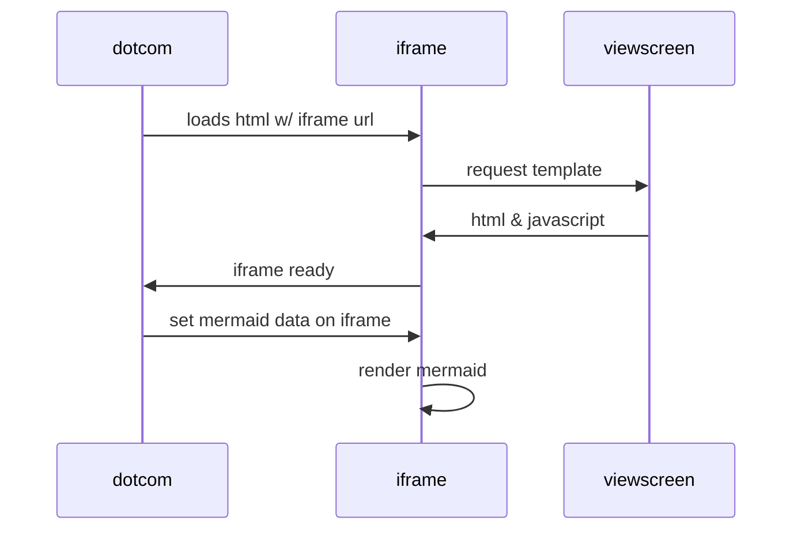
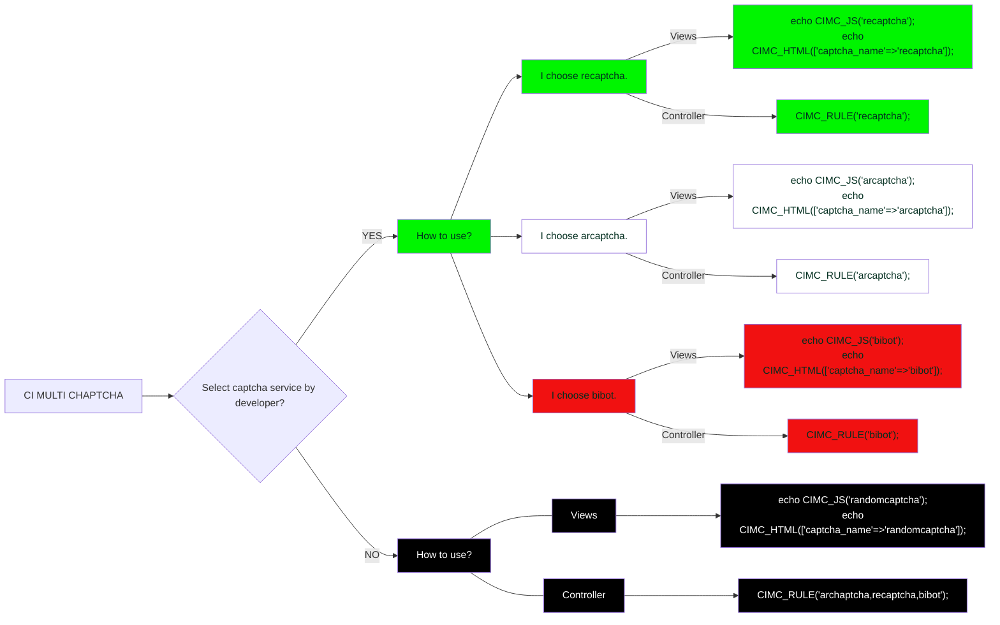
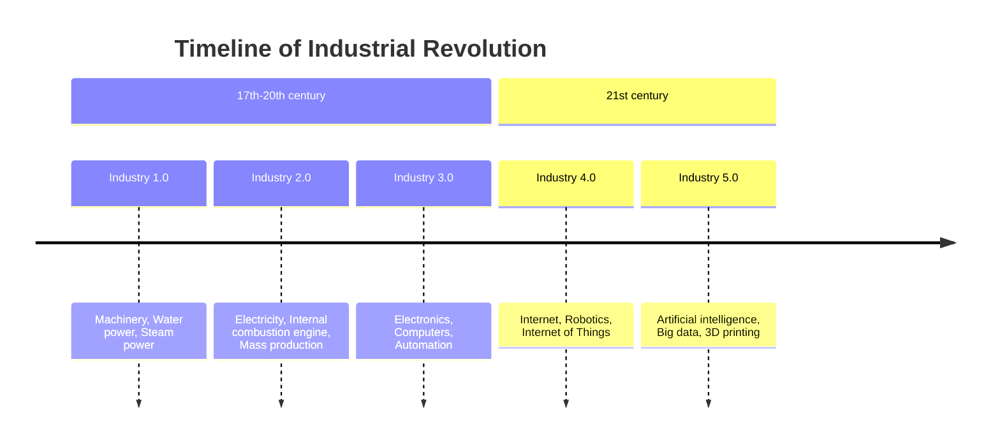

```mermaid
sequenceDiagram
    participant dotcom
    participant iframe
    participant viewscreen
    dotcom->>iframe: loads html w/ iframe url
    iframe->>viewscreen: request template
    viewscreen->>iframe: html & javascript
    iframe->>dotcom: iframe ready
    dotcom->>iframe: set mermaid data on iframe
    iframe->>iframe: render mermaid
```

```mermaid
  flowchart LR;
      A[CI MULTI CHAPTCHA]-->B{Select captcha service by developer?};
      classDef green color:#022e1f,fill:#00f500;
      classDef red color:#022e1f,fill:#f11111;
      classDef white color:#022e1f,fill:#fff;
      classDef black color:#fff,fill:#000;
      B--YES-->C[How to use?]:::green;
      
      C-->U[I choose recaptcha.]:::green;
      U--Views-->Q["echo CIMC_JS('recaptcha');\n echo CIMC_HTML(['captcha_name'=>'recaptcha']);"]:::green;
      U--Controller-->W["CIMC_RULE('recaptcha');"]:::green;
      
      C-->I[I choose arcaptcha.]:::white;
      I--Views-->O["echo CIMC_JS('arcaptcha');\n echo CIMC_HTML(['captcha_name'=>'arcaptcha']);"]:::white;
      I--Controller-->P["CIMC_RULE('arcaptcha');"]:::white;
      
      C-->X[I choose bibot.]:::red;
      X--Views-->V["echo CIMC_JS('bibot');\n echo CIMC_HTML(['captcha_name'=>'bibot']);"]:::red;
      X--Controller-->N["CIMC_RULE('bibot');"]:::red;
      
      B--NO-->D[How to use?]:::black;
      D---Views:::black-->F["echo CIMC_JS('randomcaptcha');\n echo CIMC_HTML(['captcha_name'=>'randomcaptcha']);"]:::black; 
      D---Controller:::black-->T["CIMC_RULE('archaptcha,recaptcha,bibot');"]:::black;
```

```mermaid
   timeline
     title Timeline of Industrial Revolution
     section 17th-20th century
        Industry 1.0 : Machinery, Water power, Steam <br>power
        Industry 2.0 : Electricity, Internal combustion engine, Mass production
        Industry 3.0 : Electronics, Computers, Automation
     section 21st century
        Industry 4.0 : Internet, Robotics, Internet of Things
        Industry 5.0 : Artificial intelligence, Big data, 3D printing
```
